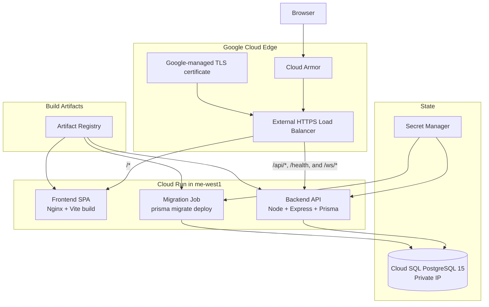

# GCP Terraform Deployment Plan

Status: implemented  
Date: 2026-05-27  
Scope: production-only deployment of the Task Manager full-stack app to Google Cloud Platform with Terraform

## Project Context

| Item | Value |
|---|---|
| GCP project name | `task-managment` |
| GCP project ID | `task-managment-497618` |
| Owner/operator account | `hishtadlut100@gmail.com` |
| Region | `me-west1` Tel Aviv, Israel |
| Production domain | `task-management.hishtadlut.link` |
| DNS provider | Cloudflare, available locally through Wrangler under `hishtadlut100@gmail.com` |
| GitHub repository | `hishtadlut/full-stack-home-assignment` |
| Gemini API key | Supplied from local environment/secrets, not committed to Terraform files |

## Summary

| Area | Decision | Why |
|---|---|---|
| Environment | Production only | This is the final project, not a staged multi-environment platform |
| Region | `me-west1` Tel Aviv, Israel | Keeps compute and database close to the expected operator/user location |
| Compute | Cloud Run for backend API and frontend SPA | Small, managed, easy to scale down operationally while keeping one warm instance |
| Scaling | `min_instances = 1`, `max_instances = 1` for the API | One hot API instance avoids cold starts and keeps in-process WebSocket subscriptions correct |
| Frontend runtime | Nginx static container on Cloud Run | Vite is only the build tool; it is not used at runtime |
| API base URL | Same-origin `/api` by default | No production `VITE_API_URL` is required when the load balancer routes `/api/*` to the backend |
| Backend | One Express API Cloud Run service | The app already reads Cloud Run's `PORT` env var |
| Database | Cloud SQL for PostgreSQL 15 over private IP | The repo already uses Prisma with PostgreSQL, so Cloud SQL is the lowest-risk managed target |
| Migrations | GitHub Actions triggers a Cloud Run Job that runs `prisma migrate deploy` | GitHub owns the deployment workflow, while the job runs inside GCP where it can reach the private database |
| Secrets | Secret Manager for `DATABASE_URL`, `JWT_SECRET`, and optional `GEMINI_API_KEY` | Cloud Run reads secrets at runtime instead of baking them into images |
| Edge | Global HTTPS Load Balancer with path routing | One public domain serves the SPA and API |
| Security | Restricted CORS, Cloud Armor, and app-level login throttling | Production allows configured browser origins; development still allows local Vite origins |

## Current Project Findings

| Concern | Current state | Deployment impact |
|---|---|---|
| Frontend | React 18, Vite, Tailwind, React Router `BrowserRouter` | Needs SPA fallback so direct visits to `/dashboard`, `/tasks/:id`, and `/assistant` return `index.html` |
| Backend | Node, Express, TypeScript, Prisma | Needs a backend Docker image and Cloud Run service |
| Database | Prisma datasource is PostgreSQL; local Docker uses Postgres 15 | Use Cloud SQL PostgreSQL 15 |
| Assistant | Uses `@google/genai` and `GEMINI_API_KEY` | Secret Manager injects the key when enabled |
| Auth | JWT auth, production requires `JWT_SECRET` | Terraform creates a generated JWT secret version |
| Login abuse | Cloud Armor cannot see email identity | App now has email/IP failed-login throttling before Terraform deployment |
| CORS | Backend no longer uses unrestricted `cors()` | Development allows localhost; production allows the configured domain and optional extra origins |
| Health | Backend exposes `GET /health` | Uptime checks and load-balancer smoke tests use `/health` |

## Target Architecture



## Request Routing

| Path | Target | Notes |
|---|---|---|
| `/api/*` | Backend Cloud Run service | Existing API routes already live under `/api/auth`, `/api/tasks`, `/api/comments`, and `/api/assistant` |
| `/health` | Backend Cloud Run service | Health and uptime check endpoint |
| `/ws/*` | Backend Cloud Run service | WebSocket task update stream |
| `/assets/*` | Frontend Cloud Run service | Hashed Vite assets with long cache headers |
| `/*` | Frontend Cloud Run service | Nginx falls back to `index.html` for React Router deep links |

## Terraform Resource Map

| Requirement | File |
|---|---|
| Providers and GCS backend | `terraform/versions.tf` |
| Production variables | `terraform/variables.tf` |
| Names, labels, image targets | `terraform/locals.tf` |
| Required GCP APIs | `terraform/apis.tf` |
| VPC, subnet, private service access | `terraform/network.tf` |
| Artifact Registry Docker repository | `terraform/artifact_registry.tf` |
| Cloud SQL PostgreSQL instance, database, SQL user | `terraform/cloud_sql.tf` |
| Secret Manager secrets and generated secret versions | `terraform/secrets.tf` |
| Runtime and optional GitHub deployer IAM | `terraform/iam.tf` |
| Cloud Run API, web, and migration job | `terraform/cloud_run.tf` |
| HTTPS load balancer, certificate, URL map, serverless NEGs | `terraform/edge.tf` |
| Cloud Armor policy | `terraform/security.tf` |
| Uptime check and optional email channel | `terraform/observability.tf` |
| Optional GitHub Actions Workload Identity Federation | `terraform/github_actions.tf` |
| Outputs | `terraform/outputs.tf` |
| Remote state bootstrap | `terraform/bootstrap-state/*` |

## Implementation Plan

### 1. Containerization

Backend:

- Build TypeScript.
- Generate Prisma client.
- Run with `node dist/server.js`.
- Include Prisma CLI in the image because the migration job reuses the backend image.

Frontend:

- Build with Vite.
- Serve static output with Nginx on port `8080`.
- Use SPA fallback for browser routes.
- Cache `/assets/*` strongly and revalidate `index.html`.

### 2. Terraform Bootstrap

Create a versioned GCS bucket for Terraform state from `terraform/bootstrap-state`.

Then initialize the main stack with:

```powershell
terraform init `
  -backend-config="bucket=<state-bucket-name>" `
  -backend-config="prefix=prod"
```

### 3. Core Infrastructure

Terraform creates:

- Required APIs.
- Artifact Registry.
- VPC and private service access.
- Cloud SQL PostgreSQL 15.
- SQL database and app user.
- Secret Manager secrets for `DATABASE_URL`, `JWT_SECRET`, and optional `GEMINI_API_KEY`.
- Cloud Run runtime service account.

### 4. Cloud Run and Edge

Terraform creates:

- API service with one warm instance.
- Web service with one warm instance.
- Migration job.
- Global HTTPS Load Balancer.
- Google-managed TLS certificate.
- Path routing for `/api/*`, `/health`, and frontend routes.
- HTTP-to-HTTPS redirect.

### 5. GitHub Actions Deployment

GitHub deployment flow:

1. `.github/workflows/tests.yml` passes on a push to `main`.
2. `.github/workflows/deploy-production.yml` authenticates to GCP with Workload Identity Federation as the Terraform-created GitHub deployer service account.
3. Build backend and frontend images tagged with the short commit SHA.
4. Push both images to Artifact Registry.
5. Update the Terraform-managed Cloud Run migration job to the new backend image.
6. Execute the migration job with `--wait`.
7. Update the API and web Cloud Run services to the new images.
8. Smoke test `/health` and `/dashboard`.

## After Apply Checklist

1. Point `task-management.hishtadlut.link` to the Terraform `load_balancer_ip` output in Cloudflare.
2. Wait for the Google-managed certificate to become active.
3. Confirm `GET https://task-management.hishtadlut.link/health` returns 200.
4. Confirm direct browser routes load:
   - `/dashboard`
   - `/assistant`
   - `/tasks/<task-id>`
5. Register a user.
6. Login.
7. Create a task.
8. Confirm the GitHub deployment run completed the migration job successfully.
9. Run `terraform plan -detailed-exitcode` and confirm no unexpected drift.

## Open Inputs

1. Optional alert email.
2. Exact local path of the env file containing `GEMINI_API_KEY` if Terraform should load it during a local plan/apply.

## Official Sources

- Cloud Run locations list `me-west1` as Tel Aviv: https://cloud.google.com/run/docs/locations
- Cloud SQL locations include `me-west1` Tel Aviv: https://cloud.google.com/sql/docs/postgres/locations
- Artifact Registry locations include `me-west1` Tel Aviv: https://cloud.google.com/artifact-registry/docs/repositories/repo-locations
- Serverless NEGs support Cloud Run behind external Application Load Balancers: https://cloud.google.com/load-balancing/docs/negs/serverless-neg-concepts
- Cloud Run ingress settings cover default URLs, domain mappings, and load balancer paths: https://cloud.google.com/run/docs/securing/ingress
